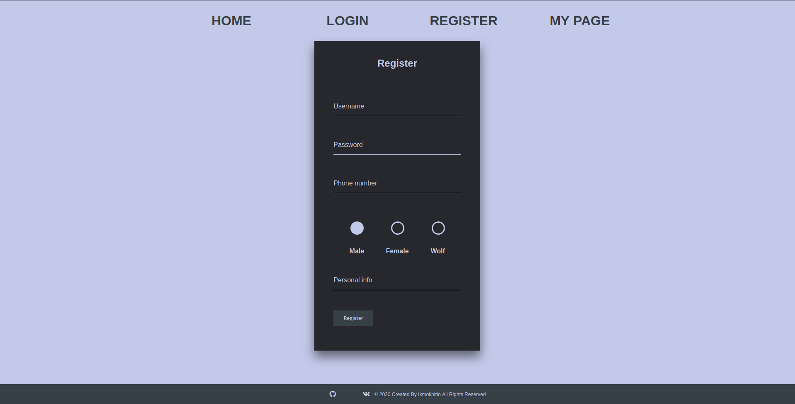

# Docker-compose web project
> Simple website with node express as web server and postgres as database





## Installation

OS X & Linux:

* First you need to install [docker and docker-compose](https://docs.docker.com/compose/install/).
* After install you should clone project from github
* Create the new network, called 'dev'
```sh
docker network create dev
```
* Start docker-compose
```sh
docker-compose up --build
```

## Usage example

A few motivating and useful examples of how your product can be used. Spice this up with code blocks and potentially more screenshots.

_For more examples and usage, please refer to the [Wiki][wiki]._

## Development setup

Describe how to install all development dependencies and how to run an automated test-suite of some kind. Potentially do this for multiple platforms.

```sh
make install
npm test
```